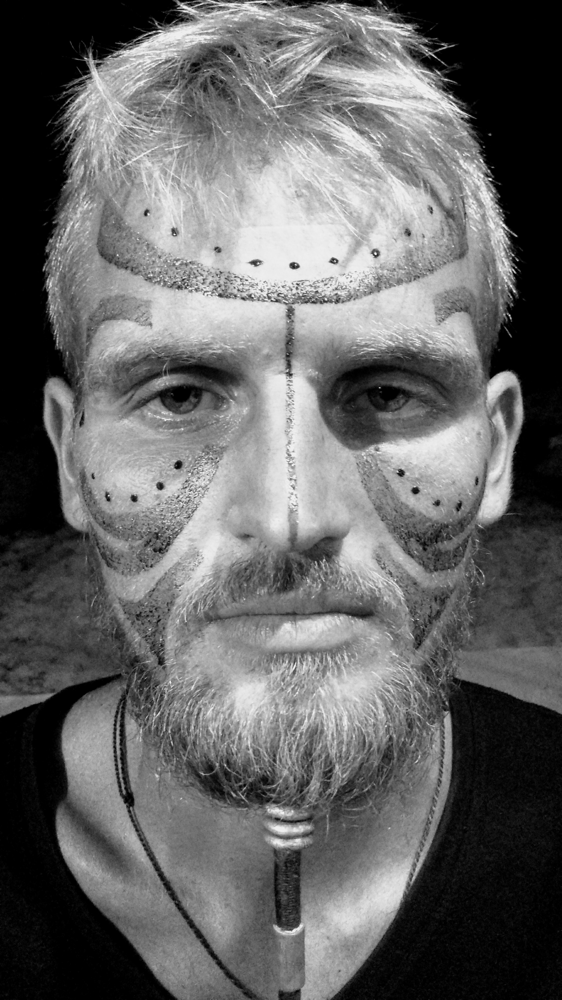
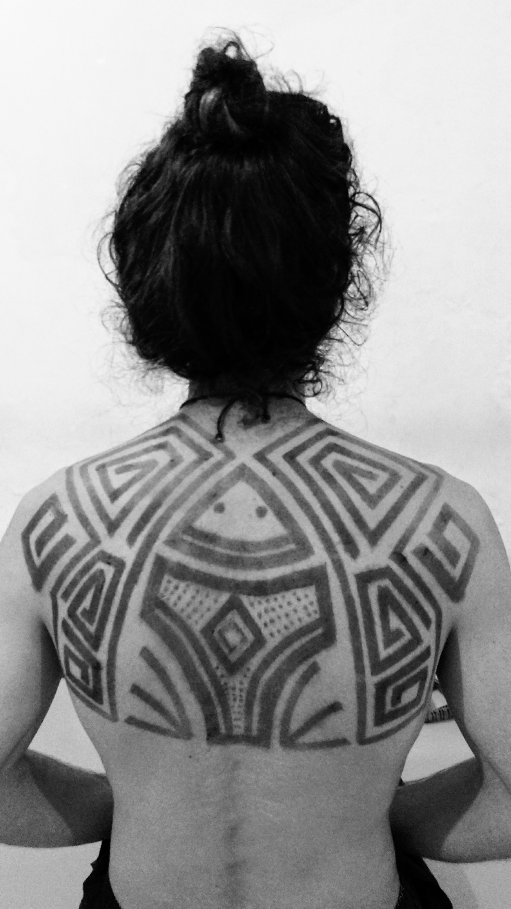
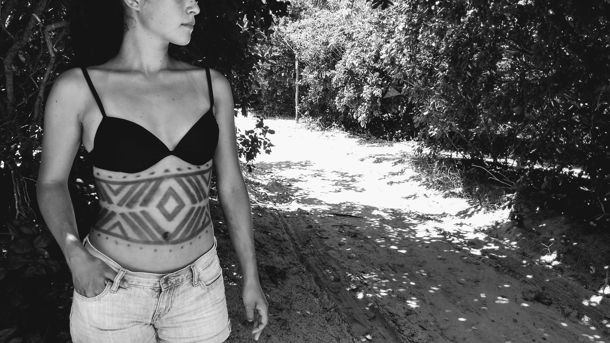
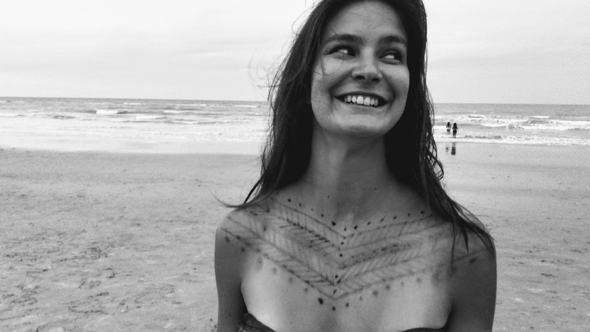
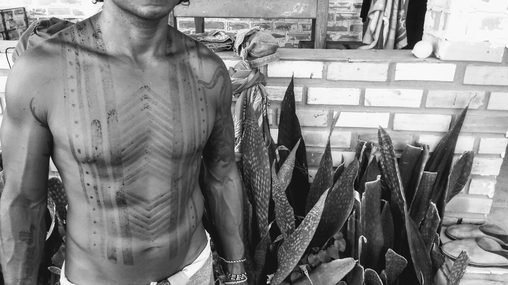
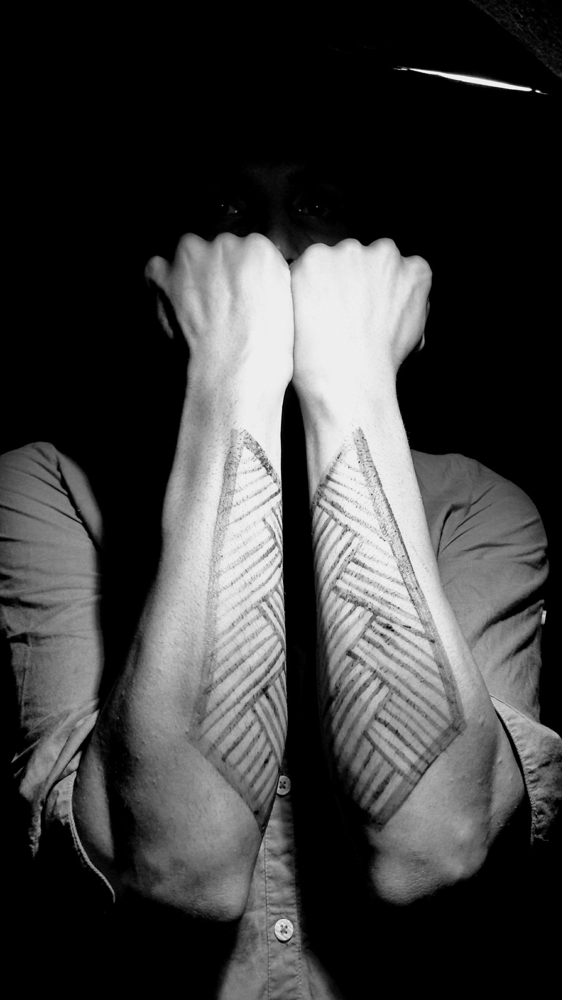

### Série de imagens feita por [Fabiano Barros](https://www.instagram.com/fabianotrama/)

A pintura corporal é, sem dúvidas, a arte indígena brasileira mais representativa dos índios. Isso porque ela não busca apenas um valor estético, mas a sim a transmissão de valores culturais de cada tribo. 

Ela é muito utilizada durante os rituais e, principalmente, como uma forma de diferenciação dos grupos, identificando a posição hierárquicas das entidades mais importantes da tribo.

Para realizar a pintura, os índios utilizam tintas naturais feitas à base de plantas e frutos. A cor branca é alcançada com o uso da tabatinga, a tonalidade vermelha, por sua vez, é obtida neste caso com Jenipapo.
 (https://www.educamaisbrasil.com.br/enem/artes/arte-indigena-brasileira)

